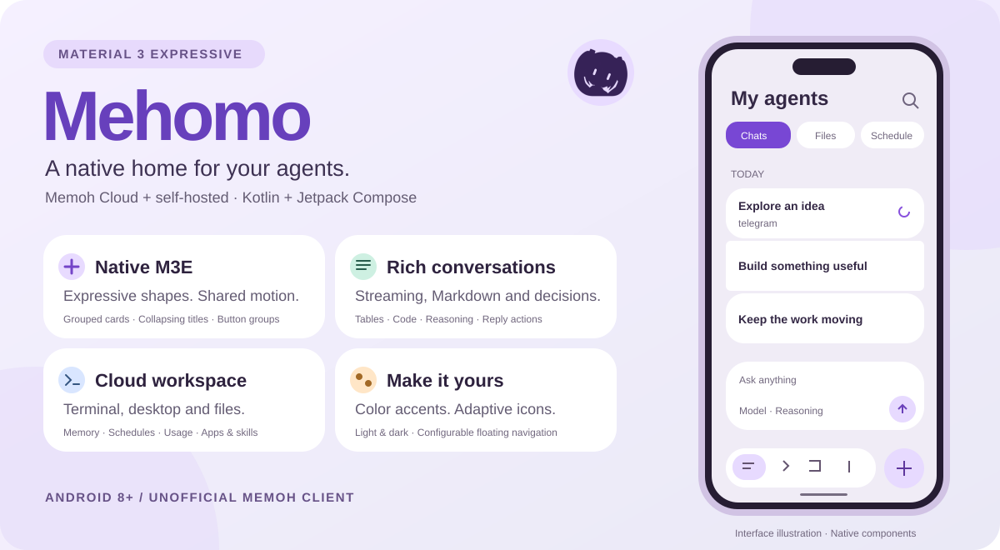

# Mehomo

**A native Android client for Memoh, designed around Material 3 Expressive.**

[Download APK](https://github.com/anamaxlec/Mehomo/releases/latest) · [简体中文](README.md) · [Memoh](https://github.com/felinics/Memoh) · [Icon assets](design/icon/README.md)

Mehomo brings conversations and an agent's cloud workspace into one Android app. It connects to **official Memoh Cloud** and **self-hosted Memoh**. This is an independent, unofficial client.

The current release is **[v0.1.10](https://github.com/anamaxlec/Mehomo/releases/tag/v0.1.10)**, adding native management, Cloud teams, attachment drafts, offline history and rich content, with shared floating navigation and refined back transitions. [Detailed release notes](docs/releases/v0.1.10.md)

## Material 3 Expressive, throughout

The interface uses native **Jetpack Compose Material 3 Expressive** components with shared shapes, motion and color roles. Chat and management pages use Compose; terminal and desktop views use bundled, dedicated web renderers.

- **Expressive controls:** grouped cards and list items, button groups, tonal actions and bounded floating menus.
- **Clear hierarchy:** large accent-colored titles collapse into the top bar as you scroll; coordinated loading placeholders soften initial loading.
- **A comfortable composer:** compact reply actions, shared input surfaces, keyboard inset handling and model/provider/reasoning selection.
- **Your layout:** choose and reorder floating navigation destinations; light/dark appearance and selectable color accents.
- **Adaptive artwork:** a purple twin-tail avatar, round adaptive launcher resources and a separate monochrome layer for themed icons.

The app uses `androidx.compose.material3:material3:1.5.0-alpha29` and follows the development of Material 3 Expressive APIs.

## What you can do

Mehomo connects your phone to an existing Memoh Bot: start a task, follow its execution, respond to decisions, and inspect the same Bot's files, terminal or desktop. Memoh runs the models and agents on the server.

| Area | Implemented actions |
|---|---|
| Bots and sessions | Select a Bot; create, search, rename and delete sessions; grouped history and external-channel labels |
| Streaming | Read replies as they arrive, inspect reasoning/tool activity, stop a run and see running-state indicators |
| Model and reasoning | Search the server catalog and group by provider; keep the menu open after selection to adjust reasoning; ordinary and ACP model paths |
| Execution context | Select server-provided workspace targets, Agent and conversation folder; show selected values in the footer |
| Context usage | Inspect server-reported context usage, refresh it, and compact context when supported |
| Reply actions | Copy, regenerate, fork from a turn and inspect timestamps |
| Attachments and decisions | Pick files/images or take a photo; preview, remove and manage attachments inside the expanded composer; choose original/compressed images, share from Android and restore drafts; approve/reject tools and answer structured questions |
| Queues and controls | Add, edit, delete and reorder follow-ups; steer supported runs; runtime/permission modes, goals and quick actions |
| Memory | List, create, edit, delete and search memories; status, graph and compaction |
| Schedules | Daily, weekly and custom cron with timezone and next-run preview; Agent, model, reasoning, workspace and run-limit settings; execution logs |
| Usage and resources | 7/30/90-day token totals, provider/model breakdowns, paginated invocation records; CPU/memory/storage when supplied by the server |
| Apps and skills | Search catalogs, inspect details, install apps with SSE progress, inspect installed items, update/removal actions; import/edit/delete skills |
| MCP | HTTP/SSE/stdio configuration, JSON import/export, OAuth authorization and revocation, connection probes and tool metadata |
| Files | Browse/filter directories; preview PDF, SVG, diagrams, formulas, Markdown, text and supported Office content; edit, create, rename, delete, upload and download |
| Terminal and desktop | PTY input/output, terminal resizing and key controls; official Cloud VNC or self-hosted WebRTC desktop |
| Browser | Open server-provided port previews for cloud apps/sites |

Markdown supports headings, paragraphs, emphasis, lists, blockquotes, rules, links, task lists, strikethrough, tables and syntax-highlighted copyable code blocks. Wide code blocks scroll horizontally and table cells wrap. History/live-output handoff uses stable message identities, and initial loads use shared skeletons.

Math, Mermaid and static SVG rendering use bundled assets. PDF pages render natively; supported documents can also be saved or opened in another app.

| Management | Native controls |
|---|---|
| Bot and Agents | Bot profile, model/media/service defaults, tool approvals, channel behavior, Agent credentials and dependencies |
| Models and services | Provider templates, API keys, model capabilities and reasoning; image, speech, transcription, video, search, fetch and memory configuration |
| Connections and automation | OAuth/API-key connectors, remote computers and runtime credentials, channel setup and routing, event hooks |
| Workspace and access | Container lifecycle, snapshots, resource settings, Bot members and permissions, channel access rules, backup export/import preview |
| Cloud teams and profile | Team selection, team profile, members, invitations, roles and ownership; quotas and billing link; official Cloud personal profile |

The composer supports camera capture, image compression and persisted text/file drafts. Recent history can be read and searched offline. Optional background monitoring delivers completion/decision notifications and Android Live Updates.

Floating navigation is shared across main destinations, Bot features, management menus and workspace views. It collapses while scrolling, hides for the keyboard and reserves space at the bottom of each page. Transitions follow the configured destination order, including RTL layouts. Back transitions use Flare-style movement and a short fade, with predictive back following gesture progress. Initial chat loading uses skeletons; loading earlier messages uses a separate 48dp indicator while message positions remain stable.

Available models, reasoning levels, targets and controls follow the server's capabilities and account permissions.

## Integration and adaptation

| Target | Adaptation |
|---|---|
| Official Memoh Cloud | Email-code login, team selection, restored encrypted cookie sessions, team-scoped requests and ticket-based WebSocket/workspace connections |
| Self-hosted Memoh | HTTPS root or `/api` reverse-proxy paths, username/password login, bearer authentication and refresh while the token remains valid |
| Chat WebSocket | Runtime subscriptions, snapshot/delta merging, acknowledgements, reconnect handling and fresh snapshots after sequence gaps |
| Bot activity SSE | Foreground session and schedule updates |
| Agent / ACP | Server catalogs/capabilities, ACP model/reasoning changes and runtime controls |
| Workspace | Local bundled xterm.js for PTY, noVNC for Cloud desktop and WebRTC for self-hosted desktop |
| External channels | Native channel configuration, routing, access rules and account-identity linking; server-supplied origins such as Telegram |

Android adaptation includes Android 8.0+ support (`minSdk 26`, `targetSdk 36`, `compileSdk 37`), native M3E controls, collapsing large titles, IME/system-bar handling, scrollable forms, responsive statistics, constrained reading width, selected font-scale checks, system/light/dark appearance, selectable accents, and 1–4 configurable floating destinations. The default icon uses a lavender background and deep-purple silhouette; night resources retain purple contrast. Android 13+ themed icons use a separate monochrome layer, with actual colors and refresh behavior controlled by a supported launcher.

## Getting started

1. Download the signed APK from [GitHub Releases](https://github.com/anamaxlec/Mehomo/releases/latest). Published builds use the same signing key and can update an existing release installation.
2. Sign in to Memoh Cloud using an email code, or enter your self-hosted HTTPS server address and credentials.
3. Choose a team and Bot. Start tasks in Chats and inspect the same workspace through Files, Terminal or Desktop.
4. Open Profile to manage Bots, Agents, models, services, connectors, channels, access and Cloud teams.

Profile also provides floating navigation order, appearance and accent settings. Choose to save the latest 10/30/50 sessions, then browse and search them in Offline History.

Background Notifications offers current-Bot monitoring, completion alerts and decision reminders. Enable monitoring and grant notification permission to keep the connection through an Android foreground service; stop monitoring from its notification. Supported Android 16 devices can show task progress with Live Updates.

Complete connector authorization through the provider. Computers connects authorized devices; network settings appear for self-hosted accounts. Read PDFs page by page and preview Office document content, or open complex layouts in a system app.

This release passes 214 JVM tests, the release build and lint, plus 15 API 36 navigation and loading tests covering menu navigation, transition direction, predictive back, larger text and chat loading.

## Build

Android **8.0+** (`minSdk 26`). Development requires **JDK 17+** and Android SDK **platform 37**; `targetSdk` is 36. Use the included Gradle wrapper.

```bash
./gradlew :app:assembleDebug
./gradlew testDebugUnitTest
```

Set `JAVA_HOME` and the SDK location through your Android Studio environment, `ANDROID_HOME`, or an untracked `local.properties`. Debug APK: `app/build/outputs/apk/debug/app-debug.apk`.

### Signed release

Create your own signing key, copy `keystore.properties.example` to `keystore.properties`, then enter the absolute key path, alias and passwords. Neither private keys nor local signing properties are committed.

```bash
./gradlew :app:assembleRelease
```

With signing configured, the APK is at `app/build/outputs/apk/release/app-release.apk`. Without signing properties, Gradle produces an unsigned release APK. Back up your signing key securely: future updates must use the same key. A release-signed APK cannot update a debug-signed installation of the same package.

## Architecture

| Module | Responsibility |
|---|---|
| `app` | Navigation, dependency injection and application entry |
| `core:model`, `core:network`, `core:data` | Models, REST/WebSocket protocol, runtime reducer, encrypted credentials and preferences |
| `core:designsystem`, `core:markdown` | Native M3E theme/components and Markdown rendering |
| `feature:login`, `feature:chat`, `feature:sessions` | Authentication, conversations, bot management and cloud workspace |
| `feature:settings`, `feature:bots` | Appearance, native management, Cloud teams, backup and offline history |

Cloud sessions use encrypted cookie storage, team selection and short-lived WebSocket tickets. Self-hosted connections use bearer authentication. Server addresses require HTTPS. Do not put real credentials in issues, logs or test fixtures.

## License and credits

Source code follows **AGPL-3.0**; see [LICENSE](LICENSE) and [third-party notices](THIRD_PARTY_NOTICES.md). Memoh is the upstream service. Mehomo is not affiliated with Memoh, Google, xAI or Crypton Future Media. The generated avatar is fan artwork inspired by Hatsune Miku and the supplied flat bot-avatar references; character and brand rights remain with their respective owners.
